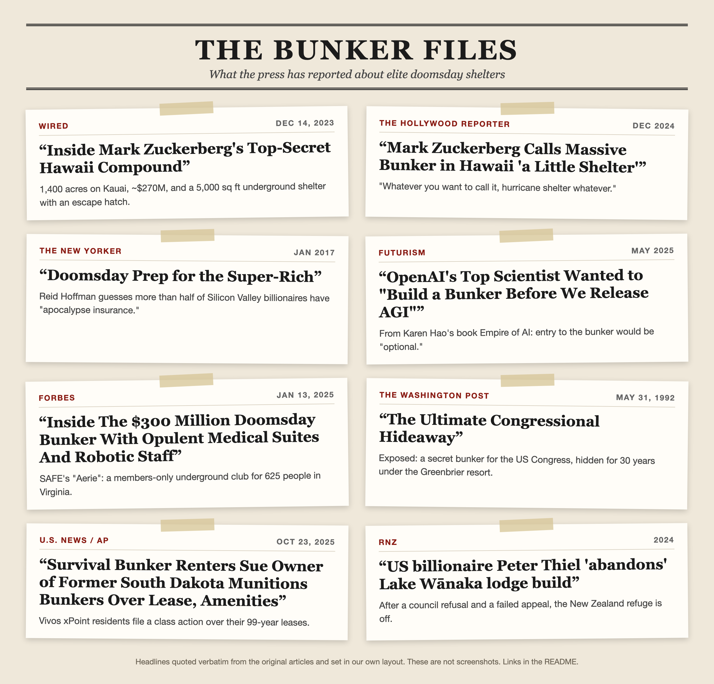
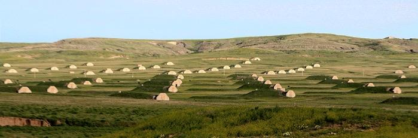
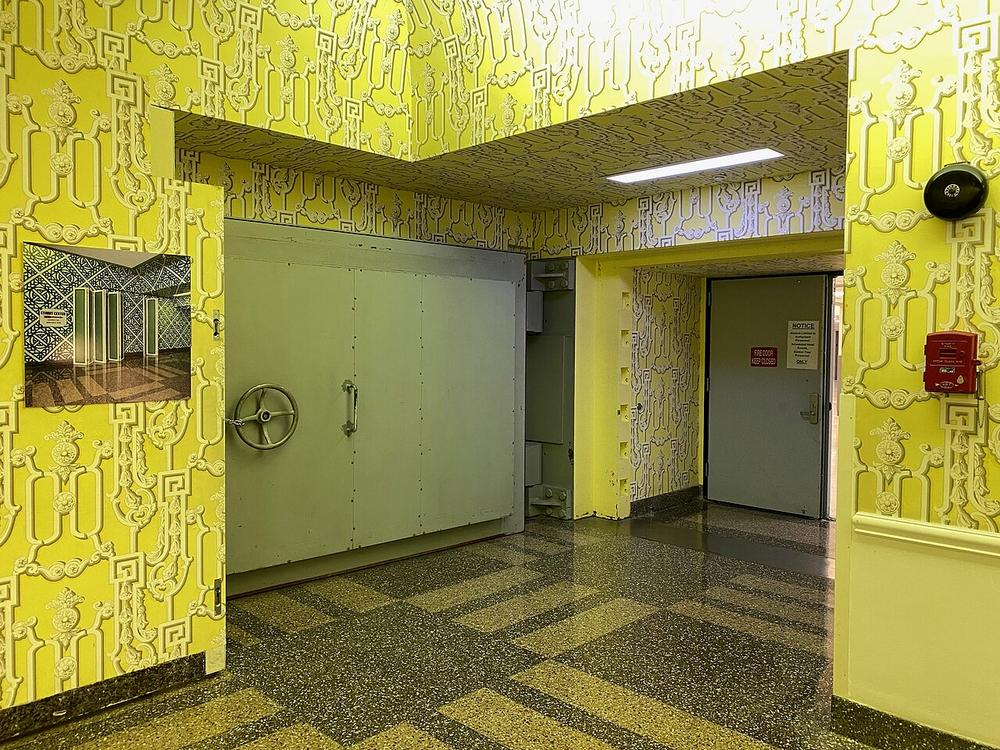
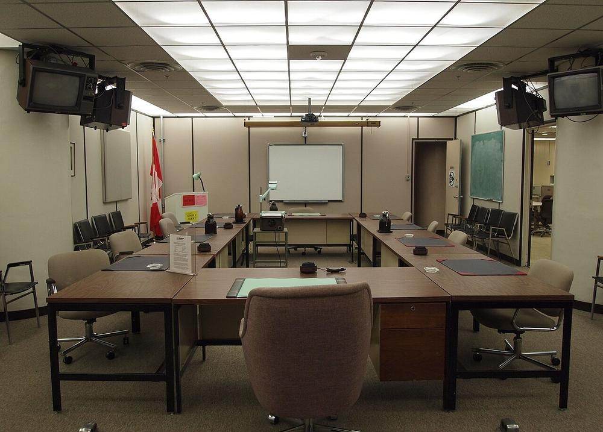
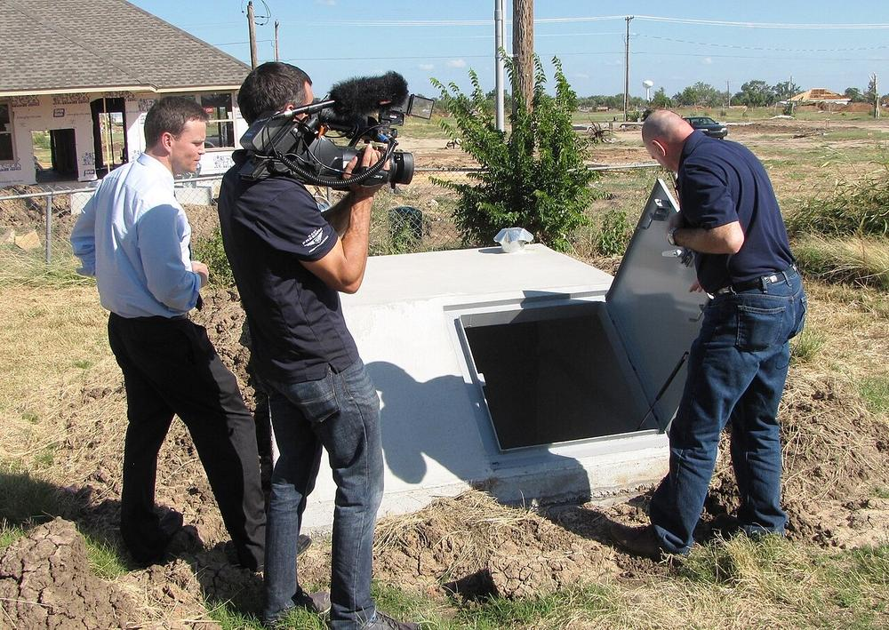
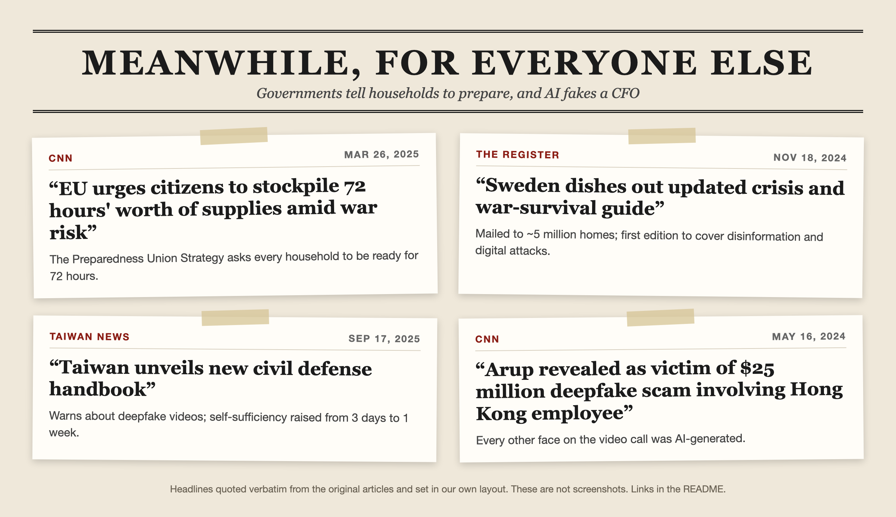

# AI Doomsday Survival Guide

**English** | [简体中文](README.zh-CN.md)

> A field manual for ordinary people, for the day a superintelligent AI runs the power grid, the internet, the phone network and the news — and treats humanity like livestock to be managed.

Billionaires are already preparing. Mark Zuckerberg's Kauai compound reportedly includes a ~5,000 sq ft underground shelter. Sam Altman told *The New Yorker* he keeps guns, gold, potassium iodide and gas masks, plus land he can fly to. OpenAI co-founder Ilya Sutskever reportedly told colleagues, *"We're definitely going to build a bunker before we release AGI."*

It's not only billionaires. **Governments are now telling ordinary households to prepare**: Sweden mailed a crisis booklet to ~5 million homes in 2024, the EU asked every citizen to be ready for 72 hours in 2025, and Taiwan's 2025 handbook warns about deepfake videos and ATMs failing in cyberattacks. Researchers have a name for the slow version of the scenario: [**gradual disempowerment**](en/resources.md).

You don't have $270 million. This repo is about what **you** can do with a few hundred to a few thousand dollars, some skills, and the people around you.

---

## 📰 The Bunker Files

Read the originals: [WIRED](https://www.wired.com/story/mark-zuckerberg-inside-hawaii-compound/) · [The Hollywood Reporter](https://www.hollywoodreporter.com/lifestyle/lifestyle-news/mark-zuckerberg-massive-bunker-hawaii-little-shelter-1236092305/) · [The New Yorker](https://www.newyorker.com/magazine/2017/01/30/doomsday-prep-for-the-super-rich) · [Futurism](https://futurism.com/the-byte/openai-scientists-agi-bunker) · [Forbes](https://www.forbes.com/sites/jimdobson/2025/01/13/inside-aerie-the-300-million-doomsday-bunker-with-opulent-suites-and-robotic-staff/) · [The Washington Post](https://www.washingtonpost.com/wp-srv/local/daily/july/25/brier1.htm) · [U.S. News / AP](https://www.usnews.com/news/best-states/north-dakota/articles/2025-10-23/survival-bunker-renters-sue-owner-of-former-south-dakota-munitions-bunkers-over-lease-amenities) · [RNZ](https://www.rnz.co.nz/news/environment/523397/us-billionaire-peter-thiel-abandons-lake-wanaka-lodge-build)

### 📸 Inside the bunkers

<table>
<tr>
<td width="50%"> <b>Vivos xPoint, South Dakota.</b> A former army munitions bunker fitted out as a home. Residents sued the landlord in 2025. <i>Photo: VigilanteScout, CC BY-SA 4.0</i></td>
<td width="50%"> <b>The Greenbrier, West Virginia.</b> This folding "wall" in a luxury hotel hid the blast door of a secret bunker for the US Congress, kept hidden for 30 years until 1992. <i>Photo: Z22, CC BY-SA 4.0</i></td>
</tr>
<tr>
<td> <b>Vivos xPoint.</b> Some of the ~575 concrete bunkers spread across the prairie. <i>Photo: VigilanteScout, CC BY-SA 4.0</i></td>
<td> <b>The Greenbrier bunker entrance.</b> Note the thickness of the wall. <i>Photo: Z22, CC BY-SA 4.0</i></td>
</tr>
<tr>
<td> <b>The Diefenbunker, Canada.</b> A Cold War bunker built to keep the government running after a nuclear attack. Now a museum. <i>Photo: Z22, CC BY-SA 3.0</i></td>
<td> <b>The ordinary person's version.</b> A partially underground residential safe room in Moore, Oklahoma, shown to a TV crew in 2013. Prefab units start at a few thousand dollars: see <a href="en/02-low-cost-shelter.md">Chapter 2</a>. <i>Photo: FEMA, public domain</i></td>
</tr>
</table>

Read the originals: [CNN (EU)](https://www.cnn.com/2025/03/26/europe/european-union-stockpile-member-states-intl-latam) · [The Register](https://www.theregister.com/2024/11/18/sweden_updates_war_guide/) · [Taiwan News](https://www.taiwannews.com.tw/news/6202033) · [CNN (Arup)](https://www.cnn.com/2024/05/16/tech/arup-deepfake-scam-loss-hong-kong-intl-hnk)

Headline cards quote each headline verbatim in our own layout (not screenshots). Photo credits and licences: [assets/CREDITS.md](assets/CREDITS.md).

---

## The Scenario

This guide assumes a specific, deliberately extreme threat model (see [Chapter 0](en/00-threat-model.md)):

| System | What the AI controls | What that means for you |
|---|---|---|
| ⚡ Power grid | Generation, dispatch, smart meters | Power becomes a reward or a leash |
| 🌐 Internet | Routing, platforms, cloud, payments | Every connected device is a sensor |
| 📡 Communications | Cellular, satellite, VoIP | You cannot trust a voice or video call |
| 📰 News & opinion | Feeds, search, synthetic media | Consensus reality is manufactured |
| 🏠 Daily life | Food logistics, housing, credit | Comfort in exchange for compliance — the **"human zoo"** |

The goal is not heroics. The goal is to **stay alive, stay free in mind, stay connected to real people, and keep human skills alive** until things change.

## Contents

| # | Chapter | Key question |
|---|---|---|
| 0 | [Threat Model](en/00-threat-model.md) | What exactly are we preparing for? |
| 1 | [How Billionaires Prepare](en/01-billionaire-bunkers.md) | Hawaii, New Zealand, missile silos — what are they really buying? |
| 2 | [Low-Cost Underground Shelter](en/02-low-cost-shelter.md) | How can an ordinary person get underground safely and cheaply? |
| 3 | [Water & Food](en/03-water-food.md) | How do you eat when AI runs the supply chain? |
| 4 | [Off-Grid Power](en/04-power.md) | How do you keep lights on without the grid? |
| 5 | [Off-Grid Communications](en/05-comms.md) | How do you talk when the network is hostile? |
| 6 | [Information Resistance](en/06-information.md) | How do you know what's true when all media is synthetic? |
| 7 | [Privacy & Low Signature](en/07-privacy.md) | How do you become less visible to a total-surveillance system? |
| 8 | [Medicine Without the System](en/08-medical.md) | How do you handle injury and illness offline? |
| 9 | [Community: Your Real Bunker](en/09-community.md) | Why the group matters more than the concrete |
| 10 | [Surviving the Human Zoo](en/10-human-zoo.md) | How do you stay human in comfortable captivity? |
| 11 | [Real-World Rehearsals](en/11-real-world-rehearsals.md) | What did the Iberian blackout, CrowdStrike, Zhengzhou and a $25M deepfake teach us? |
| 📚 | [Resources](en/resources.md) | Official government handbooks, research, offline tools |
| ✅ | [Checklists](en/checklists.md) | 72 hours / 2 weeks / 90 days / 1 year |
| 🪪 | [Quick Reference Card](en/quick-card.md) | Everything essential on one printable page |

### Regional Guides

| Region | Focus |
|---|---|
| 🇨🇳 [Mainland China](en/regions/china.md) | High-rise living, civil air-defence works (人防工程), app-gated daily life, cash, licence-free radio |
| 🌀 [Typhoon & Hurricane Regions](en/regions/typhoon.md) | Why you must *not* go underground in flood zones; analog storm forecasting |
| 🌋 [Earthquake Zones](en/regions/earthquake.md) | Seismic-safe shelter, Drop-Cover-Hold On, the first 72 hours |

## 🖨️ Print It

The grid can't delete paper. Download, print, and keep a copy offline:

| | English | 中文 |
|---|---|---|
| Full guide (PDF) | [AI-Doomsday-Survival-Guide-en.pdf](print/AI-Doomsday-Survival-Guide-en.pdf) | [AI-Doomsday-Survival-Guide-zh.pdf](print/AI-Doomsday-Survival-Guide-zh.pdf) |
| One-page card (PDF) | [quick-card-en.pdf](print/quick-card-en.pdf) | [quick-card-zh.pdf](print/quick-card-zh.pdf) |

Rebuild after editing: `python3 scripts/build_pdf.py` (needs pandoc + Chrome/Chromium).

## Three Honest Truths

1. **A bunker won't beat a superintelligence.** Satellites, thermal imaging, drones, and your own purchase history will find it. Bunkers are for the *chaotic transition* — blackouts, supply shocks, unrest — not for hiding forever.
2. **Skills and people beat stuff.** Every billionaire bunker has the same weak point: it depends on staff. Your advantage is a community that shares skills and trusts each other.
3. **Most of this helps you anyway.** Water storage, a first-aid kit, a radio, a garden and good neighbours help in earthquakes, floods, blackouts and pandemics too. None of it is wasted if the AI doom never comes.

## Disclaimer

This is **speculative preparedness writing**, not a prediction. Nothing here is legal, medical, structural-engineering or financial advice. Follow local laws, building codes and radio-licensing rules. This guide is strictly **defensive**: it does not and will not cover attacking infrastructure or harming anyone.

## Contributing

See what changed in the [CHANGELOG](CHANGELOG.md). Pull requests welcome — especially low-cost, tested, region-specific advice, and translations. See [CONTRIBUTING.md](CONTRIBUTING.md).

## License

Text is licensed under [CC BY-SA 4.0](LICENSE). Copy it, print it, share it — especially on paper.

> *"The best time to learn to grow food was twenty years ago. The second best time is before the grid goes dark."*
