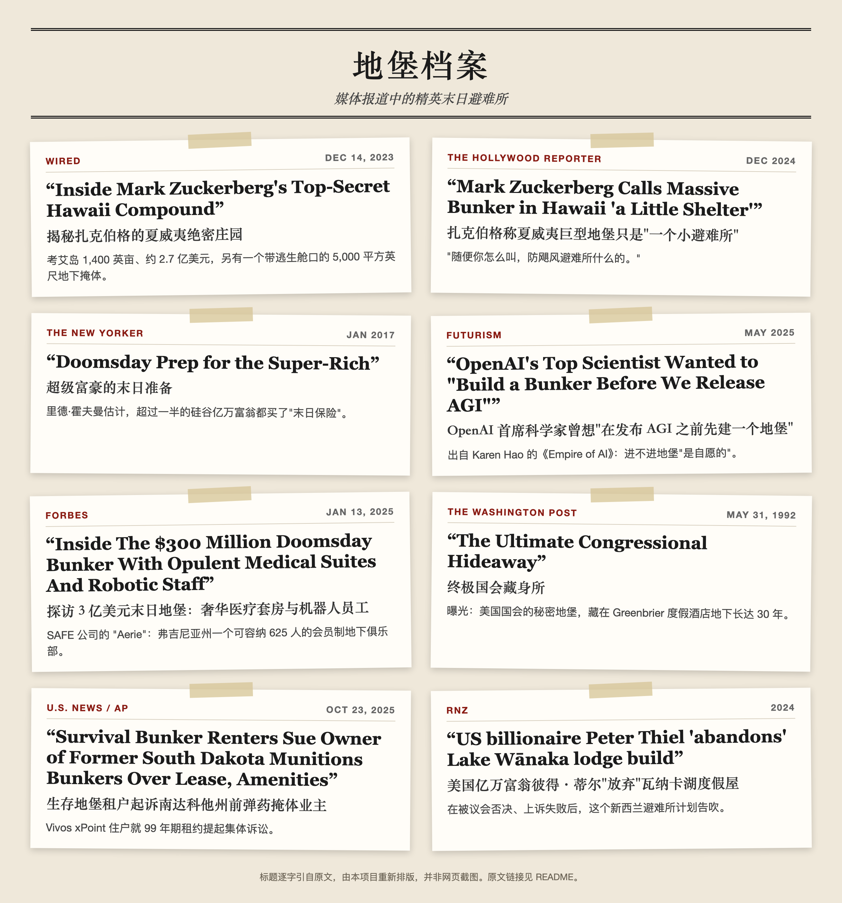
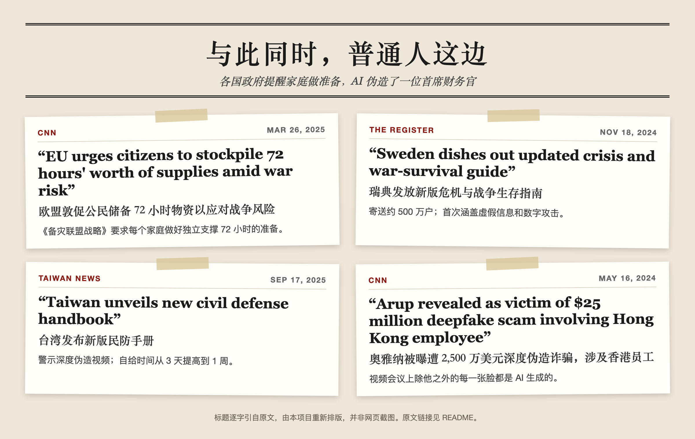

# AI 末日求生指南

[English](README.md) | **简体中文**

> 一本写给普通人的野外手册：假如有一天，超级 AI 接管了电网、互联网、通信网络和新闻舆论，把人类当作"圈养动物"来管理——你该怎么活下去。

富豪们已经在准备了。据报道，扎克伯格在夏威夷考艾岛的庄园里有一个约 5,000 平方英尺（约 460 平方米）的地下掩体。Sam Altman 曾对《纽约客》说，他备有枪支、黄金、碘化钾和防毒面具，还有一块可以随时飞过去的土地。据报道，OpenAI 联合创始人 Ilya Sutskever 曾对同事说：*"在发布 AGI 之前，我们肯定要先建一个地堡。"*

不只是富豪。**各国政府也开始提醒普通家庭做准备**：瑞典在 2024 年向约 500 万户寄送危机手册，欧盟在 2025 年要求每位公民做好独立支撑 72 小时的准备，台湾 2025 年版手册则警示深度伪造视频和网络攻击导致 ATM 失灵。研究者还为这个情景的"慢速版本"起了名字：[**渐进式失权**](zh/resources.md)。

你没有 2.7 亿美元。这个仓库讲的是：**你**用几百到几千美元、一些技能、以及身边的人，能做些什么。

---

## 📰 地堡档案

阅读原文：[WIRED](https://www.wired.com/story/mark-zuckerberg-inside-hawaii-compound/) · [The Hollywood Reporter](https://www.hollywoodreporter.com/lifestyle/lifestyle-news/mark-zuckerberg-massive-bunker-hawaii-little-shelter-1236092305/) · [The New Yorker](https://www.newyorker.com/magazine/2017/01/30/doomsday-prep-for-the-super-rich) · [Futurism](https://futurism.com/the-byte/openai-scientists-agi-bunker) · [Forbes](https://www.forbes.com/sites/jimdobson/2025/01/13/inside-aerie-the-300-million-doomsday-bunker-with-opulent-suites-and-robotic-staff/) · [华盛顿邮报](https://www.washingtonpost.com/wp-srv/local/daily/july/25/brier1.htm) · [U.S. News / 美联社](https://www.usnews.com/news/best-states/north-dakota/articles/2025-10-23/survival-bunker-renters-sue-owner-of-former-south-dakota-munitions-bunkers-over-lease-amenities) · [RNZ](https://www.rnz.co.nz/news/environment/523397/us-billionaire-peter-thiel-abandons-lake-wanaka-lodge-build)

### 📸 地堡内部

<table>
<tr>
<td width="50%"> <b>Vivos xPoint，美国南达科他州。</b>由前陆军弹药掩体改造成的住所。2025 年，住户把房东告上了法庭。<i>摄影：VigilanteScout，CC BY-SA 4.0</i></td>
<td width="50%"> <b>Greenbrier 度假酒店，美国西弗吉尼亚州。</b>豪华酒店里这面可折叠的"墙"，遮住了美国国会秘密地堡的防爆门，隐藏了 30 年，直到 1992 年才被曝光。<i>摄影：Z22，CC BY-SA 4.0</i></td>
</tr>
<tr>
<td> <b>Vivos xPoint。</b>散布在草原上的约 575 座混凝土掩体中的一部分。<i>摄影：VigilanteScout，CC BY-SA 4.0</i></td>
<td> <b>Greenbrier 地堡入口。</b>注意墙体的厚度。<i>摄影：Z22，CC BY-SA 4.0</i></td>
</tr>
<tr>
<td> <b>北京地下城。</b>上世纪七十年代挖掘的防空隧道网络，是中国人防工程的历史缩影，见<a href="zh/regions/china.md">中国大陆专题</a>。<i>摄影（1991）：Gary Todd，CC0</i></td>
<td> <b>普通人的版本。</b>2013 年，美国俄克拉何马州摩尔市一个半地下式家庭安全屋，正在接受电视台拍摄。预制产品几千美元起，见<a href="zh/02-low-cost-shelter.md">第 2 章</a>。<i>摄影：FEMA，公共领域</i></td>
</tr>
</table>

阅读原文：[CNN（欧盟）](https://www.cnn.com/2025/03/26/europe/european-union-stockpile-member-states-intl-latam) · [The Register](https://www.theregister.com/2024/11/18/sweden_updates_war_guide/) · [Taiwan News](https://www.taiwannews.com.tw/news/6202033) · [CNN（奥雅纳）](https://www.cnn.com/2024/05/16/tech/arup-deepfake-scam-loss-hong-kong-intl-hnk)

标题卡片逐字引用原标题并由本项目重新排版（非网页截图）。图片作者与许可证见 [assets/CREDITS.md](assets/CREDITS.md)。

---

## 情景设定

本指南基于一个刻意极端化的威胁模型（见[第 0 章](zh/00-threat-model.md)）：

| 系统 | AI 控制了什么 | 对你意味着什么 |
|---|---|---|
| ⚡ 电网 | 发电、调度、智能电表 | 电力变成奖励或者缰绳 |
| 🌐 互联网 | 路由、平台、云、支付 | 每一台联网设备都是传感器 |
| 📡 通信 | 蜂窝网络、卫星、网络电话 | 你无法信任任何语音或视频通话 |
| 📰 新闻舆论 | 信息流、搜索、合成媒体 | "共识现实"是被制造出来的 |
| 🏠 日常生活 | 食品物流、住房、信用 | 用舒适换服从——**"人类动物园"** |

目标不是当英雄。目标是：**活下来，保持思想自由，和真实的人保持连接，让人类的技能不失传**，直到局势发生变化。

## 目录

| # | 章节 | 核心问题 |
|---|---|---|
| 0 | [威胁模型](zh/00-threat-model.md) | 我们到底在为什么做准备？ |
| 1 | [富豪们如何备战末日](zh/01-billionaire-bunkers.md) | 夏威夷、新西兰、导弹发射井——他们到底买了什么？ |
| 2 | [低成本地下掩体](zh/02-low-cost-shelter.md) | 普通人如何安全、便宜地躲到地下？ |
| 3 | [水与食物](zh/03-water-food.md) | AI 控制供应链时，你吃什么？ |
| 4 | [离网电力](zh/04-power.md) | 没有电网，灯怎么亮？ |
| 5 | [离网通信](zh/05-comms.md) | 网络充满敌意时，怎么联络？ |
| 6 | [信息抵抗](zh/06-information.md) | 所有媒体都可能是合成的，怎么判断真假？ |
| 7 | [隐私与低信号](zh/07-privacy.md) | 如何在全面监控下降低可见度？ |
| 8 | [脱离体系的医疗](zh/08-medical.md) | 离线状态下如何处理伤病？ |
| 9 | [社区：你真正的地堡](zh/09-community.md) | 为什么人比混凝土更重要 |
| 10 | [在"人类动物园"中生存](zh/10-human-zoo.md) | 在舒适的囚禁中如何保持人性？ |
| 11 | [现实中的预演](zh/11-real-world-rehearsals.md) | 伊比利亚大停电、CrowdStrike 宕机、郑州暴雨、2 亿港元深度伪造诈骗教会了我们什么？ |
| 📚 | [资源](zh/resources.md) | 各国官方手册、研究、离线工具 |
| ✅ | [清单](zh/checklists.md) | 72 小时 / 2 周 / 90 天 / 1 年 |
| 🪪 | [一页速查卡](zh/quick-card.md) | 所有要点浓缩在一张可打印的纸上 |

### 地区专题

| 地区 | 重点 |
|---|---|
| 🇨🇳 [中国大陆](zh/regions/china.md) | 高层住宅、人防工程、App 化的日常生活、现金、免执照对讲机 |
| 🌀 [台风/飓风地区](zh/regions/typhoon.md) | 为什么在洪涝区*绝不能*躲到地下；不靠网络预判风暴 |
| 🌋 [地震带](zh/regions/earthquake.md) | 抗震掩体、伏地-遮挡-手抓牢、震后 72 小时 |

## 🖨️ 打印出来

电网删不掉纸张。下载、打印，离线保存一份：

| | English | 中文 |
|---|---|---|
| 完整指南（PDF） | [AI-Doomsday-Survival-Guide-en.pdf](print/AI-Doomsday-Survival-Guide-en.pdf) | [AI-Doomsday-Survival-Guide-zh.pdf](print/AI-Doomsday-Survival-Guide-zh.pdf) |
| 一页速查卡（PDF） | [quick-card-en.pdf](print/quick-card-en.pdf) | [quick-card-zh.pdf](print/quick-card-zh.pdf) |

修改内容后重新生成：`python3 scripts/build_pdf.py`（需要 pandoc 和 Chrome/Chromium）。

## 三条诚实的真相

1. **地堡打不过超级智能。** 卫星、热成像、无人机，以及你自己的购物记录都会暴露它。地堡的作用是熬过*混乱的过渡期*——停电、断供、社会动荡——而不是永远藏起来。
2. **技能和人，胜过物资。** 每座富豪地堡都有同一个弱点：它依赖雇来的人。你的优势是一个彼此信任、共享技能的社群。
3. **这些准备无论如何都有用。** 储水、急救包、收音机、菜园和好邻居，在地震、洪水、停电和疫情中同样管用。即使 AI 末日永远不来，这些也不会白费。

## 免责声明

这是**推演性质的防灾写作**，不是预言。本文内容不构成法律、医疗、结构工程或财务建议。请遵守当地法律、建筑规范和无线电执照规定。本指南严格限于**防御性**内容：不涉及、也不会涉及攻击基础设施或伤害任何人。

## 参与贡献

更新内容见 [CHANGELOG](CHANGELOG.md)。欢迎提交 PR——特别是低成本、经过实践检验、针对特定地区的建议，以及翻译。见 [CONTRIBUTING.md](CONTRIBUTING.md)。

## 许可证

文本采用 [CC BY-SA 4.0](LICENSE) 许可。复制它、打印它、分享它——尤其是印在纸上。

> *"学会种粮食的最好时机是二十年前；其次，是在电网熄灭之前。"*
