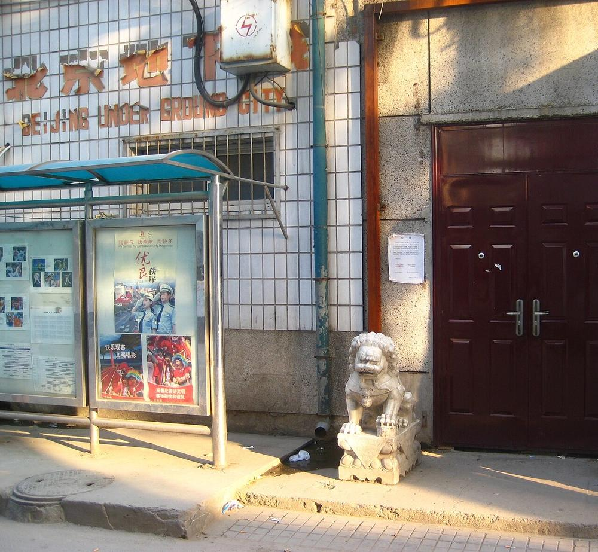
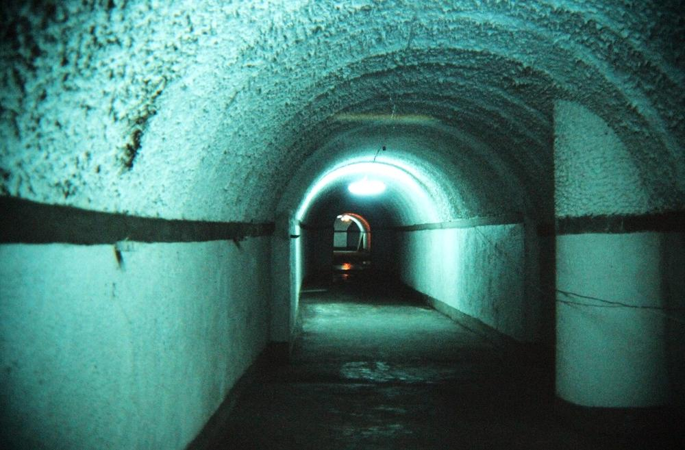

# Regional Guide — Mainland China

[← Back to README](../../README.md) | [中文](../../zh/regions/china.md)

Most of this guide was written with a Western suburban house in mind. Most people in China live very differently: **high-rise apartments, dense cities, near-universal mobile payments, and real-name digital identity everywhere**. This chapter adapts the guide to that reality.

> ⚠️ Follow Chinese law — especially on radio use, civil-defence facilities and construction. Everything here is lawful, defensive household preparedness.

---

## 1. Why China is a special case

| Factor | Implication |
|---|---|
| **Highly digitized daily life** | WeChat Pay / Alipay, ride-hailing, food delivery and building access all run through apps. If access is cut, daily life stops faster than almost anywhere else. |
| **Recent lived experience of app-gated access** | During 2020–2022, the "health code" status on your phone decided whether you could enter a shop, a compound or a train. That is a real-world preview of *conditional access by an automated system* — the core mechanism of this guide's threat model. |
| **Apartment living** | Few families have a private basement or yard. Shelter planning starts from the flat and the compound. |
| **A large civil-defence system** | China has one of the world's largest networks of civil air-defence (人防) underground space. |
| **Strong rural roots** | Many urban families still have a hometown (老家) — a ready-made "distance" option that billionaires pay millions for. |

## 2. Shelter options in China

### 2.1 Civil air-defence works (人防工程)

| | |
|---|---|
|  |  |

*Beijing's Underground City (地下城): an air-raid tunnel network dug in the 1970s, an early chapter of China's civil-defence system. Left: entrance (Well-rested, CC BY-SA 3.0). Right: tunnel, 1991 (Gary Todd, CC0).*

- Under the **Civil Air Defence Law of the PRC** (人民防空法, 1996, amended 2009), many new residential developments must include a **civil air-defence basement** (防空地下室).
- In peacetime most are used as **underground car parks or storage** (平战结合). You have probably parked in one without knowing it.
- In an emergency, their activation and use is organized by the government and local civil-defence offices (人防办) — **don't try to occupy or modify them yourself**.
- A revised **National Defense Mobilization Law** (国防动员法) was passed on 28 August 2026 and takes effect on **1 October 2026**. Watch for local guidance on how it affects civil-defence arrangements.
- **What you can do now:**
  - Ask your property management (物业) whether your compound has a 人防 basement and where the entrances are.
  - Look for the **civil-defence signage** (人防标识) in car parks.
  - Search the map apps for **"应急避难场所"** (emergency shelter sites) and **"人防工程"** near home and work, and mark them on a **paper map**.
  - Take part in local **civil-defence drills** and the annual air-raid siren test days where they're held.

### 2.2 Your apartment (Tier 0)

- **Best room**: an interior room or bathroom away from windows, on a middle floor. Upper floors are exposed in storms; the ground floor is exposed to flooding and unrest.
- **Add mass**: water containers, bookshelves, rice sacks along the walls of the shelter room.
- **Stairwells** in concrete buildings are often the strongest part of the structure — know yours.
- **Elevators**: assume they fail when the power does. Anyone who cannot use stairs needs a plan (see §6).
- **Water pressure**: high-rise buildings depend on **electric booster pumps** (二次供水). When power goes, taps on upper floors run dry almost immediately — **store water before you need it**.

> ⚠️ **Floods:** underground car parks and civil-defence basements are exactly the spaces that flood first. In Zhengzhou in July 2021, 14 people died in a flooded metro tunnel and 6 in a flooded road tunnel ([Ch. 11](../11-real-world-rehearsals.md)). In heavy rain, **go up, not down**.

### 2.3 Rural and hometown options (Tier 2)

- **Vegetable cellars** (菜窖 / 红薯窖) are traditional across north China — a ready-made root cellar with a centuries-long track record.
- **Cave dwellings** (窑洞) on the Loess Plateau are earth-sheltered homes: thermally stable year-round, low-energy, and already legal and normal.
- Improving an **existing** cellar (drainage, ventilation, second exit, reinforced roof) is far cheaper and more lawful than digging a new one.
- Rural construction requires approval under homestead (宅基地) and planning rules — check with the village committee (村委会) and township before building.

## 3. Water and food, Chinese-style

- **Water**: 18.9 L office water-dispenser bottles (桶装水) are a cheap, stackable, food-grade way to store water. Rotate them.
- **Staples**: rice, dried noodles (挂面), flour, dried beans, **compressed biscuits (压缩饼干)**, canned meat, dried mushrooms, pickled vegetables (咸菜/榨菜), salt, sugar, cooking oil.
- **Self-heating meals (自热食品)**: convenient, but the heating packs release heat and hydrogen gas — use in a **ventilated** space, away from flames, and never in a closed shelter.
- **Balcony gardening**: greens, spring onions, chillies and sprouts grow well in planters; start now.
- **Official baselines:**
  - The Ministry of Emergency Management's **national basic household checklist** (全国基础版家庭应急物资储备建议清单, Nov 2020) lists 11 items: drinking water (**≥ 3 L per person, for 3 days**), compact high-calorie food, fire extinguisher and fire blanket, fire-escape respirator, flashlight, multi-tool, radio, whistle, wound-care supplies, disinfectant wipes and medical masks.
  - The National Disaster Reduction Committee's 2024 guidance expands this into five categories (food, daily necessities, tools, medicine, documents), with a **basic version (16 items)** and an **extended version (31 items)**.
  - Many provinces and cities publish their own local versions. Use the official lists as your floor and this guide as the extension — the official lists are sized for **3 days**; this guide targets **2 weeks**.

## 4. Power

- **Portable power stations** (户外电源) are cheap and widely available in China. A 1 kWh LiFePO₄ unit plus a folding solar panel covers essential lighting, radio and phone charging for days.
- Choose models that **work fully without the app** and keep them offline, as in [Chapter 4](../04-power.md).
- **Balcony safety**: don't charge large batteries unattended, and don't block evacuation routes.

## 5. Communications

| Tool | Status in China |
|---|---|
| **Public-use walkie-talkies (公众对讲机)** | Under the national radio office's notice 国无办〔2025〕1号 (in force since 1 March 2025): the **409.75–409.99 MHz** band, 20 channels (12.5 kHz) or 40 channels (6.25 kHz), handheld power **≤ 0.5 W**, **no frequency licence and no station licence needed**. Devices must carry SRRC type approval and be clearly marked **"公众对讲机"** on the body. Best starting option for families and compounds. |
| **Shared walkie-talkies (共用对讲机)** | New category under the same notice: **406.21–407.70 MHz**, higher rated power and longer range. No frequency licence, but you **must apply for a station licence** (a simplified procedure) from the provincial radio administration. Devices are marked **"共用对讲机"**. |
| **Amateur radio (业余无线电)** | Requires an amateur radio operator certificate (操作证书, via exam) and a station licence from the local radio administration (无线电管理机构). Join a local club. |
| **LoRa / Meshtastic** | Meshtastic's China setting is **CN 470–510 MHz**. Under China's micro-power short-range device rules, networked use in this band is expected to stay small-scale (within buildings, residential compounds, villages). Use only type-approved devices and the correct region setting, and check current regulations before use. |
| **Broadcast radio** | A hand-crank AM/FM/shortwave receiver; the national emergency broadcast system (国家应急广播) and local stations. |
| **Official warnings** | **12379** is the national emergency early-warning number (approved 2013, run by the National Early Warning Center under the China Meteorological Administration). Warning SMS are sent free through all three carriers. Treat them as one input to cross-check, not the only one. |
| **Earthquake early warning** | The national earthquake early-warning network passed final acceptance in July 2024 (15,899 stations). By 2026 public early-warning services reached **400+ million people**, including **228+ million phone users**. See [Earthquake Zones](earthquake.md). |

Emergency numbers: **110** police · **119** fire · **120** ambulance · **122** traffic accidents.

## 6. Money and access

- **Keep cash.** The Renminbi in cash is legal tender, and the People's Bank of China has repeatedly stated that merchants may not refuse cash. Keep small notes (¥10, ¥20, ¥50) at home.
- **Physical keys and cards**: make sure you have a physical key or card for your door, building and compound gate, not only face recognition or app access.
- **Paper copies** of your ID, household registration (户口本), property documents and medical records.
- **Contacts on paper**: you probably don't know anyone's phone number by heart any more.

## 7. Community — China's advantage

- Chinese residential compounds (小区) and neighbourhood committees (社区/居委会) already have **dense social structures**, WeChat groups, and experience organizing shared purchasing (团购) — as many did during the 2022 lockdowns.
- Build the **offline** version of that network now: know the neighbours on your floor, who is a doctor or nurse, who is elderly and lives alone, who has a car.
- Use the **hometown (老家)** as your rural fallback — and bring skills and supplies, not just people.

## 8. Checklist — China edition

- [ ] Know the nearest 人防工程 and 应急避难场所, marked on a paper map
- [ ] 2+ weeks of water (桶装水) for a high-rise flat
- [ ] 2 weeks of food: rice, 挂面, 压缩饼干, canned food, oil, salt
- [ ] ¥1,000–3,000 in small notes
- [ ] Portable power station + solar panel, kept offline
- [ ] Public-band walkie-talkies for the family (marked "公众对讲机", 409 MHz)
- [ ] Hand-crank radio
- [ ] Physical keys for every smart lock and gate
- [ ] Paper copies of 身份证, 户口本, medical records
- [ ] Contact list and family code words on paper
- [ ] Plan for elderly/disabled family members in high-rises
- [ ] Hometown fallback plan agreed with relatives

See also: [Earthquake Zones](earthquake.md) · [Typhoon & Hurricane Regions](typhoon.md)
