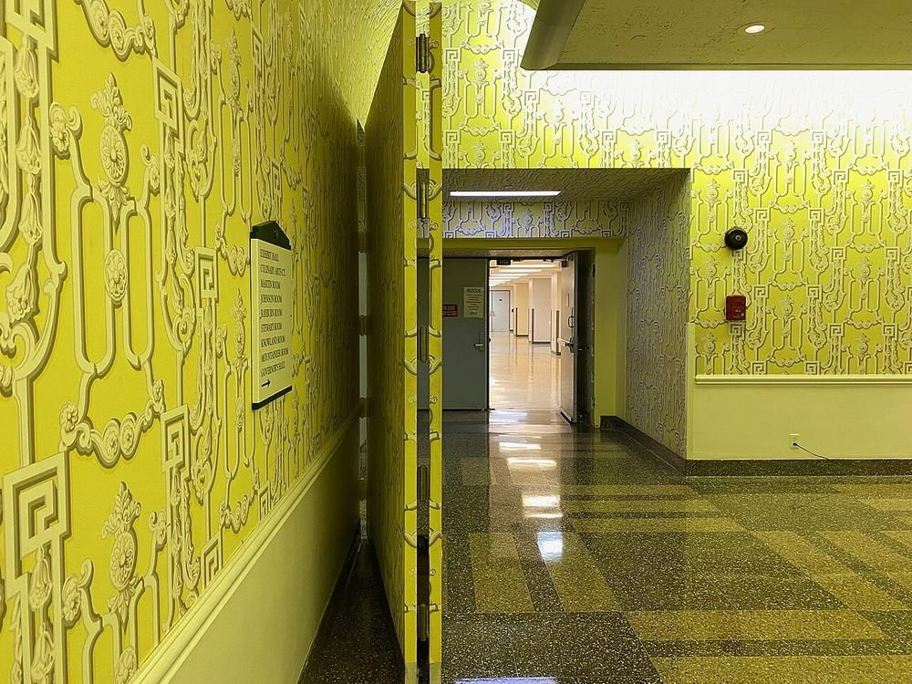
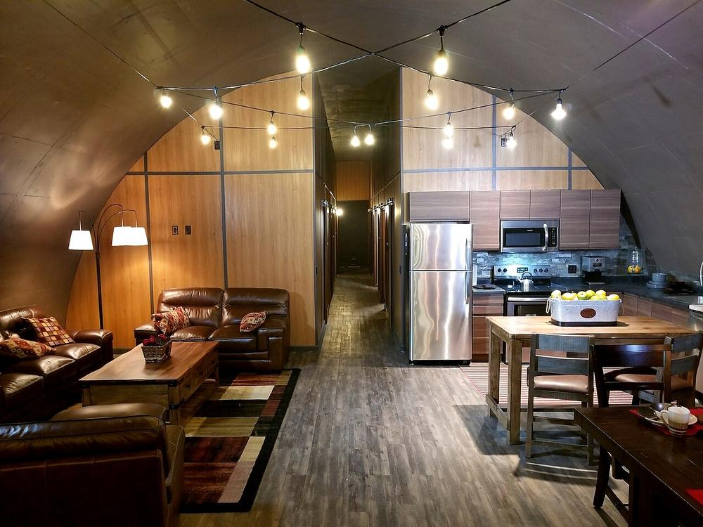

# 第 1 章 —— 富豪们如何备战末日

[← 返回目录](../README.zh-CN.md) | [English](../en/01-billionaire-bunkers.md)

正在打造 AI 的那群人，恰恰是地球上最积极的末日准备者之一。光这一点就值得深思。

本章考察超级富豪实际建了什么，把它们拆解为**他们花钱购买的功能**，再给出每一项的普通人版本。

> ⚠️ 以下细节来自公开报道（来源见文末）。私人庄园高度保密，具体数字请视为*据报道*，而非已证实。

---

## 1.1 案例

### 马克·扎克伯格 —— 夏威夷考艾岛 Koolau 牧场

- 位于考艾岛、占地约 **1,400 英亩**（约 570 公顷）的庄园，《连线》（Wired）2023 年 12 月报道其总成本约 **2.7 亿美元**。
- 规划文件显示有一个**约 5,000 平方英尺（约 460 平方米）的地下掩体**，包含生活空间、机房和一个**逃生舱口**，配有一扇**灌注混凝土的金属门**（掩体的常见设计），以及独立的**能源和食物供给**。
- 据报道，两栋主宅（合计约 **57,000 平方英尺**）由一条**地下通道**相连，通道再分岔通往掩体。
- 据报道，施工人员都签署了严格的**保密协议（NDA）**。
- 2024 年接受《彭博》采访时，扎克伯格称之为*"一个小避难所……随便你怎么叫，防飓风避难所什么的"*，并说外界把整个牧场说成末日地堡是"夸大其词"。

**他买的是：** 距离（一座岛）、独立的电力、水和食物、隐蔽且加固的空间、保密性。

### 为什么是夏威夷（以及岛屿）？

- 远离人口中心和冲突地区
- 全年可种植，雨水充沛
- 大海是天然屏障
- 缺点：岛屿严重依赖进口食品和燃料——供应链崩溃时受冲击*极大*。拉里·埃里森买下了夏威夷拉奈岛的大部分，但即便拥有整座岛，也还是离不开货船。

### 彼得·蒂尔 —— 新西兰

- 2011 年在几乎没在当地居住的情况下获得新西兰国籍，并在南岛**瓦纳卡湖**附近购地。
- 他在当地山坡上修建大型"度假屋"的计划于 **2022 年被当地规划部门否决**，**上诉也被新西兰环境法院驳回**，2024 年有报道称他已**放弃该项目**。即便是亿万富翁，也无法在一个说"不"的国家里直接买下避难所。
- 新西兰成为精英阶层*首选*的避难地：偏远、稳定、说英语、粮食自给。

**他买的是：** 第二个司法管辖区——从一个崩溃体系中的法律和物理出口。

### Sam Altman —— "枪、黄金和防毒面具"

在 2016 年《纽约客》的人物特写中，Altman 说：*"我有枪、黄金、碘化钾、抗生素、电池、水、以色列国防军的防毒面具，还有大瑟尔（Big Sur）的一大块地，我随时可以飞过去。"*

**他买的是：** 富豪版的"应急包"——药品、自卫、便携的价值储存、一个偏远的目的地。

### Ilya Sutskever —— "发布 AGI 之前先建地堡"

据 Karen Hao 所著《Empire of AI》（2025）记载，时任 OpenAI 首席科学家的 Sutskever 在 2023 年对研究员们说：*"在发布 AGI 之前，我们肯定要先建一个地堡。"*——并补充说，进不进去是自愿的。

**这告诉我们：** 一些离这项技术最近的人，认真到愿意为灾难性结局规划物理避难所。

### 硅谷的"末日保险"

- 领英联合创始人里德·霍夫曼对《纽约客》（2017）说，他估计超过一半的硅谷亿万富翁都有某种形式的"**末日保险**"——一处偏远房产、一个地堡、一套计划。
- 媒体理论家道格拉斯·拉什科夫在《富人的生存》（*Survival of the Richest*，2022）中描述，他曾受邀为一群富有投资人提供咨询，他们最关心的问题是：**"大事件"发生后，我如何控制我自己的保镖？** 他们想到的办法包括给食物仓库装密码锁、给保镖戴电击项圈。拉什科夫的回答是：*现在*就好好对待他们，将来他们才会忠诚。

### 最早的精英地堡：Greenbrier（1958–1992）

最早的"富豪地堡"其实是政府建的。在美国西弗吉尼亚州豪华的 **Greenbrier 度假酒店**地下，美国政府秘密为整个**国会**修建了一座地堡（"希腊岛计划"）。当地人被告知那只是酒店扩建，酒店走廊里一面可折叠的假墙遮住了防爆门。它保密了约 30 年，直到 1992 年被《华盛顿邮报》曝光（《终极国会藏身所》），该计划随即终止。

| | |
|---|---|
|  |  |
| *Greenbrier：遮住防爆门的那面"墙"（Z22，CC BY-SA 4.0）* | *Vivos xPoint 样板地堡，南达科他州（VigilanteScout，CC BY-SA 4.0）* |

**启示：** 保密和掩护说法（"只是酒店的一个侧翼"、"只是个地窖"）是老办法了。见[第 2 章](02-low-cost-shelter.md)和[第 7 章](07-privacy.md)。

### 商业化豪华地堡

| 项目 | 地点 | 据报道的细节 |
|---|---|---|
| **Survival Condo Project** | 美国堪萨斯州 | 2008 年以约 30 万美元买下的 Atlas 导弹发射井，改造成约 15 层的地下综合体，设计可供约 75 人生活最长 5 年；单元据报售价约 100 万至 450 万美元以上，另收月费；有泳池、影院、水培农场、武器库 |
| **Vivos xPoint** | 美国南达科他州 | 草原上 500 多座前陆军弹药掩体，按 99 年期租赁；预付费据报从约 2.5 万美元涨到约 5.5 万美元，另加年租金。内部装修由买家自理。2025 年，住户就租约和承诺的配套设施提起了**集体诉讼** |
| **Vivos Europa One** | 德国 | 冷战时期的加固设施，改建为私人公寓 |
| **SAFE 公司的 "Aerie"** | 美国弗吉尼亚州 | 计划中的约 3 亿美元会员制地下俱乐部，可容纳 **625 人**，单元据报最高 2,000 万美元，配有泳池、餐厅和"AI 辅助"医疗套房；宣称 2026 年亮相 |

---

## 1.2 他们实际在买什么

去掉大理石和酒窖，每座精英地堡买的都是同样的**七项功能**：

| # | 功能 | 富豪版 | 普通人版 | 章节 |
|---|---|---|---|---|
| 1 | **距离** | 海岛、新西兰、私人飞机 | 亲戚的乡下房子、一小块地、事先约定的集合点 | [9](09-community.md) |
| 2 | **加固空间** | 防爆门、钢筋混凝土 | 地下室改造、地窖、覆土房间 | [2](02-low-cost-shelter.md) |
| 3 | **空气** | 核生化过滤系统 | 密封房间 + 带过滤的手动通风 | [2](02-low-cost-shelter.md) |
| 4 | **水与食物** | 数年储备、水培 | 储水 + 过滤器、轮换储粮、菜园、种子 | [3](03-water-food.md) |
| 5 | **电力** | 私人微电网 | 小型太阳能 + 电池、手摇、柴火取暖 | [4](04-power.md) |
| 6 | **安保与保密** | 保密协议、保镖、武器库 | 低调、可信的邻居、不对外说 | [7](07-privacy.md) |
| 7 | **人** | 雇佣员工 | 共享技能、真正互信的社群 | [9](09-community.md) |

## 1.3 富豪模式的弱点

理解他们的弱点，就能看到*你*的优势在哪里。

1. **依赖员工。** 地堡需要工程师、厨师、保镖和医生。花钱买来的忠诚很脆弱——拉什科夫的那群投资人心知肚明。
2. **可见性。** 建筑许可、卫星图像、承包商记录、物资配送。超级智能 AI 会知道地球上每一座私人地堡的位置。很多走投无路的人也会知道。
3. **联网系统。** 豪华地堡依赖智能空调、联网安防摄像头、自动化水处理——恰恰是 AI 能够触及的系统。
4. **物资有限。** 储备总会耗尽。没有种植技能和社群，地堡只是一个慢慢被吃空的罐头。
5. **怎么过去。** 私人飞机需要燃料、机场、空管和 GPS。在 AI 控制的世界里，这些全都在别人手里。
6. **治理。** 共享地堡社区同样需要规则、契约和信任。Vivos xPoint 的住户最后**把房东告上了法庭**。买下一个地堡，并不等于买到一个运转良好的社区。
7. **许可。** 蒂尔的新西兰避难所被当地议会和法院否决。一个需要别人批准的避难所，并不真正属于你。

## 1.4 你的优势

- **你不是目标。** 没有人盯着你家找地堡。
- **你可以就地生存。** 你不需要飞到任何地方。
- **你可以建立真正的信任。** 你今天帮助的邻居，因共同经历而忠诚，而不是因为工资。
- **你可以刻意保持低技术。** 手压水泵和柴火炉没有任何"攻击面"。

## 1.5 要点

> 富人买的是**距离、围墙和仆人**。
> 你应该建设的是**技能、物资和邻居**。

地堡是应对混乱*头几周*的工具，不是在超级智能统治下生活的方案。真正的方案在第 6–10 章。

---

## 参考来源

- Guthrie Scrimgeour，关于扎克伯格考艾岛庄园的报道，《Wired》，2023 年 12 月
- 扎克伯格关于"小避难所"的采访，《Bloomberg》，2024；《Time》《Fortune》2024 年相关报道
- Tad Friend，"Sam Altman's Manifest Destiny"，《The New Yorker》，2016 年 10 月
- Evan Osnos，"Doomsday Prep for the Super-Rich"，《The New Yorker》，2017 年 1 月
- Karen Hao，*Empire of AI*，Penguin Press，2025
- Douglas Rushkoff，*Survival of the Richest: Escape Fantasies of the Tech Billionaires*，W. W. Norton，2022
- 《奥塔哥每日时报》《新西兰先驱报》及 RNZ 关于蒂尔瓦纳卡度假屋的报道（2022 年被议会否决、上诉被环境法院驳回、2024 年据报放弃）
- Survival Condo Project 与 Vivos 公开资料；《南达科他新闻观察》与美联社关于 Vivos xPoint 集体诉讼的报道（2025）
- 《Forbes》，"Inside Aerie, the $300 million doomsday bunker"，2025 年 1 月
- Ted Gup，"The Ultimate Congressional Hideaway"，《华盛顿邮报》，1992 年 5 月 31 日；原子遗产基金会，"Greenbrier Bunker"

下一章：[第 2 章 —— 低成本地下掩体 →](02-low-cost-shelter.md)
